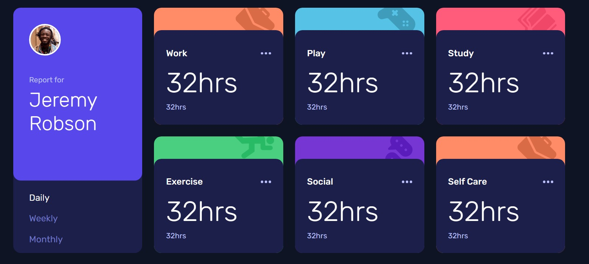

# Frontend Mentor - Time tracking dashboard solution

This is a solution to the [Time tracking dashboard challenge on Frontend Mentor](https://www.frontendmentor.io/challenges/time-tracking-dashboard). Frontend Mentor challenges help you improve your coding skills by building realistic projects.

## Table of contents

- [Overview](#overview)
  - [The challenge](#the-challenge)
  - [Screenshot](#screenshot)
  - [Links](#links)
- [My process](#my-process)
  - [Built with](#built-with)
  - [What I learned](#what-i-learned)
  - [Continued development](#continued-development)
  - [Useful resources](#useful-resources)
- [Author](#author)

## Overview

### The challenge

Users should be able to:

- View the optimal layout for the site depending on their device's screen size
- See hover states for all interactive elements on the page
- Switch between viewing Daily, Weekly, and Monthly stats

### Screenshot



### Links

- Solution URL: [Repository](https://github.com/jonghwascript/time-tracking-dashboard.git)
- Live Site URL: [Live site](https://jonghwascript.github.io/time-tracking-dashboard.git)

## My process

### Built with

- Semantic HTML5 markup
- CSS custom properties
- CSS Grid
- Flexbox
- Mobile-first workflow
- [Sass/SCSS](https://sass-lang.com/) - modular partials (`_variables`, `_mixins`, `_reset`)
- [Gulp](https://gulpjs.com/) - task runner for compiling SCSS to CSS, generating sourcemaps, and formatting with Prettier

### What I learned

While structuring the markup, I focused on choosing HTML elements based on their meaning rather than their default appearance, and made sure to check the accessibility implications of each choice:

- [Structuring content with semantic HTML](https://developer.mozilla.org/en-US/docs/Learn_web_development/Core/Structuring_content)
- [HTML: A good basis for accessibility](https://developer.mozilla.org/ko/docs/Learn_web_development/Core/Accessibility/HTML)
- [HTML elements reference](https://developer.mozilla.org/ko/docs/Web/HTML/Reference/Elements)

I also learned that loading a font with a `<link>` tag performs better than importing it with `@import`, since the browser can discover and start fetching the stylesheet earlier instead of waiting for the CSS to be parsed first:

```html
<link
  href="https://fonts.googleapis.com/css2?family=Rubik:wght@300;400;500&display=swap"
  rel="stylesheet"
/>
```

A typo also taught me how strict a Sass mixin can be: my `mq()` mixin raises `@error` when it's given a breakpoint name that isn't in the `$breakpoints` map. Passing `'table'` instead of `'tablet'` didn't just skip that media query - it stopped the whole SCSS build from compiling, so the site kept running on stale CSS until I caught the typo.

I also ran into a CSS Grid + Flexbox interaction: a `.box` card shares a grid row with the taller `.repoter` sidebar on desktop, so Grid's default `align-self: stretch` makes `.box` grow to match. But its `.wrapper` child was a plain block box sized to its own content, so it didn't grow with it and left a colored gap at the bottom of the card. Turning `.box` into a flex column and giving `.wrapper` `flex: 1 1 auto` made it fill whatever height `.box` ends up with.

### Continued development

I fixed the height of the dashboard's first grid row (the profile card) to a set value to match the design, but I'd like to explore whether that's the right approach or whether there's a more flexible way to size that row that still holds up across breakpoints.

### Useful resources

- [MDN - Structuring content with semantic HTML](https://developer.mozilla.org/en-US/docs/Learn_web_development/Core/Structuring_content) - Helped me pick the right semantic elements for the dashboard layout.
- [MDN - HTML: A good basis for accessibility](https://developer.mozilla.org/ko/docs/Learn_web_development/Core/Accessibility/HTML) - Clarified how semantic markup choices affect accessibility.

## Author

- Frontend Mentor - [@jonghwascript](https://www.frontendmentor.io/profile/jonghwascript)
